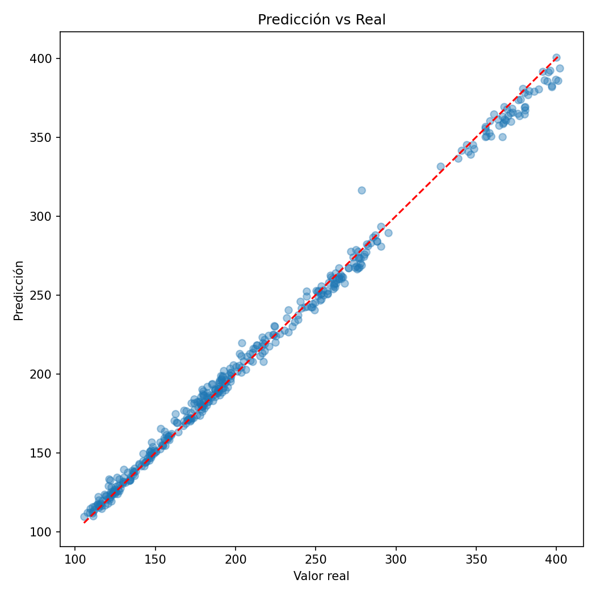

# Modelo Predictivo de Coste de Producción de Memorias RAM


Este repositorio contiene un proyecto de desarrollo de un modelo predictivo para estimar el coste de producción de memorias RAM a partir de diferentes características técnicas del producto. El objetivo es explorar cómo variables como la capacidad, velocidad, latencia, voltaje, número de módulos o características físicas pueden influir en el coste de fabricación.

Para ello se utiliza un conjunto de datos sintético generado con inteligencia artificial, diseñado para simular información realista del mercado de módulos de memoria RAM. Este dataset permite realizar análisis exploratorio, ingeniería de variables y el entrenamiento de modelos de machine learning orientados a la predicción del precio o coste de producción.


## 🚀 Características del proyecto

- 📊 Generación y uso de dataset sintético (RAM)
- 🧹 Pipeline completo de limpieza y tipado de datos
- 🤖 Modelo de Machine Learning basado en **XGBoost**
- 🔍 Evaluación con métricas: MAE, RMSE, R² y WAPE
- 💾 Serialización del modelo (`.pkl`)
- ⚡ API REST con FastAPI para inferencia en tiempo real
- 🌐 Interfaz web simple para consumir la API
- 🧱 Arquitectura modular y escalable


## 🏗️ Arquitectura del proyecto

````
├── src/
│ ├── inference.py                  # Lógica de inferencia
│ ├── utils_inference.py            # Limpieza y utilidades ML
| ├── train_costes.py               # Script de entrenamiento
| ├── main.py                       # API FastAPI
│ ├── utils_db.py                   # Conexión a base de datos
│ ├── logger_config.py              # Sistema de logging
│ └── __init__.py
│
├── models/                         # Modelos serializados (.pkl)
├── data/                           
├── outputs/                        # Resultados (gráficas, importancias…)
├── logs/                           # Logs de ejecución
├── index.html                      # Frontend de prueba
└── README.md

````

## 📊 Dataset

El dataset contiene variables como:

- Marca
- Tipo (DDR4 / DDR5)
- Capacidad (GB)
- Velocidad (MHz)
- Latencia CAS
- Voltaje
- Número de módulos
- Disipador
- RGB
- Precio (variable objetivo)

Este dataset se obtiene desde base de datos mediante SQL Server, lo que permite simular un entorno más realista de producción.


## 🧠 Modelo de Machine Learning

El modelo utilizado es un:

👉 **XGBoost Regressor**

Integrado dentro de un pipeline de `scikit-learn` que incluye:

- Imputación de nulos (media, mediana, moda)
- Codificación One-Hot para variables categóricas
- Tratamiento diferenciado por tipo de variable

El pipeline completo se construye dinámicamente en función del tipo de columnas detectadas.


## 📈 Métricas de evaluación

Se utilizan las siguientes métricas:

- **MAE** (Mean Absolute Error)
- **RMSE** (Root Mean Squared Error)
- **R² Score**
- **WAPE** (Weighted Absolute Percentage Error)


## 📈 Resultados

El modelo ha sido evaluado utilizando un esquema de validación con separación en:

- Train: 60%
- Validation: 20%
- Test: 20%

Dataset total: **2000 muestras** con 9 variables predictoras.

---

### 🔍 Métricas en validación

| Métrica | Valor |
|--------|------|
| MAE    | 4.05 |
| RMSE   | 5.68 |
| R²     | 0.994 |
| WAPE   | 1.92% |

---

### 🧪 Métricas en test

| Métrica | Valor |
|--------|------|
| MAE    | 3.94 |
| RMSE   | 5.38 |
| R²     | 0.996 |
| WAPE   | 1.84% |

---

### 🧠 Interpretación

- 📉 Error medio muy bajo (~4 USD)
- 🎯 R² cercano a 1 → el modelo explica prácticamente toda la varianza
- 📊 WAPE < 2% → excelente precisión relativa
- 🔁 Resultados consistentes entre validación y test → **baja probabilidad de overfitting**


⚠️ Nota: Dado que el dataset es sintético, estos resultados representan un escenario idealizado. En un entorno real, sería necesario validar el modelo con datos reales y analizar posibles desviaciones.

### 📊 Predicción vs Real




## ⚙️ Instalación

```bash
git clone https://github.com/tu-repo.git
cd tu-repo

pip install -r requirements.txt
```


## 🔌 API de predicción

El proyecto incluye una API REST construida con FastAPI.

### ▶️ Arranque

````
uvicorn src.main:app --reload
````
### 📍 Endpoints disponibles

````
GET /
Verifica que la API está operativa

GET /health
Estado del servicio
Indica si el modelo está cargado en memoria

POST /predict
Realiza una predicción de coste
```` 

Ejemplo de request:

````json
{
  "datos": {
    "Marca": "Corsair",
    "Tipo": "DDR5",
    "Capacidad_GB": 32,
    "Velocidad_MHz": 6000,
    "Latencia_CAS": 36,
    "Voltaje": 1.35,
    "RGB": true,
    "Disipador": "Sí",
    "Modulos": 2
  }
}
````

Ejemplo de respuesta:

````json
{
  "ok": true,
  "resultado": {
    "prediccion_coste": 152.34
  }
}
````

La API carga el modelo al iniciar y lo mantiene en memoria para mejorar el rendimiento.


## ⚙️ Configuración de base de datos

La conexión a SQL Server se realiza mediante variables de entorno:

````
DB_USER=usuario
DB_PASSWORD=password
DB_SERVER=servidor
DB_NAME=base_datos
DB_DRIVER=ODBC Driver 17 for SQL Server
````

El sistema utiliza SQLAlchemy para gestionar la conexión.